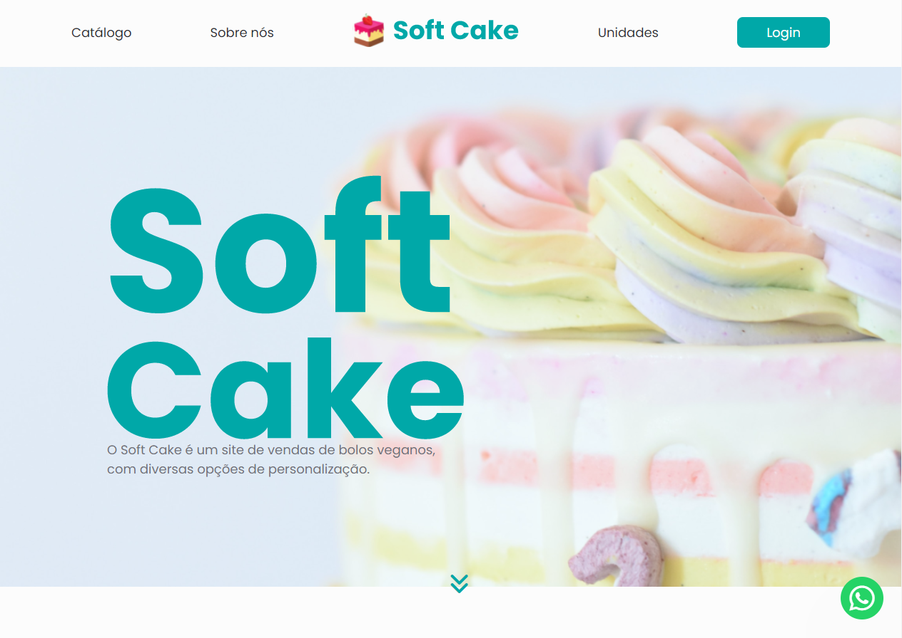

# Soft Cake

 

> A empresa **Soft Cake** procura um site no qual seja possível expor seus produtos (bolos veganos) e informações sobre os mesmos e as unidades franqueadas. Além disso, solicitaram que fosse possível controlar o cadastro de clientes e suas compras, sendo esses registros disponibilizados posteriormente em forma de relatórios para usuários administradores. A empresa cliente indicou que as compras não seriam feitas no site, mas em plataformas como WhatsApp, sendo necessário desenvolver, portanto, ferramentas que direcionem o cliente para tais plataformas. 

> A empresa **MIPE**  disponibilizou-se para desenvolver esse projeto, consistindo em uma central de desenvolvedores de sistemas que visa propiciar à interação de aplicação entre cliente e servidor e outros sistemas computacionais, com a persistência de dados, bem como o desenvolvimento das competências de gestão adequadas a diferentes situações profissionais.
 
"Aceitamos a proposta desenvolvendo sistemas de software, de acordo com as especificações, considerando as boas práticas do mercado de tecnologia da informação e as necessidades do usuário”. - MIPE 💻

> Foi dado o início na elaboração da proposta durante o segundo semestre de 2021 no [SENAI JANDIRA](https://jandira.sp.senai.br/), com a parceria das turmas de Administração (clientes que trouxeram a proposta do site para  apresentar seus produtos) e Desenvolvimento de Sistemas (responsavéis pela criação do site). Tivemos momentos oportunos para reuniões de informações,  decisões e feedback.  

## 💻 Design

 [ | LINK DO FIGMA |](https://www.figma.com/file/pFgsQbvtgvT4WVCoPQJTGV/SoftCake?node-id=0%3A1) 

## 🤝 Colaboradores

Pessoas que contribuíram para este projeto:

<table>
  <tr>
    <td align="center">
      <a href="#">
         
        
          <b>Maria Luiza</b>
        
      </a>
    </td>
    <td align="center">
      <a href="#">
         
        
          <b>Isabela Romanato</b>
        
      </a>
    </td>
    <td align="center">
      <a href="#">
              
        
          <b>Pedro Monteiro</b>
        
      </a>
    </td>
    <td align="center">
      <a href="#">
          
        
          <b>Erick Nathan</b>
        
      </a>
    </td>
  </tr>
</table>

## 📚 Orientador

Professor do [SENAI JANDIRA](https://jandira.sp.senai.br/) que contribuiu e orientou para construção do projeto:

<table>
  <tr>
    <td align="center">
      <a href="#">
        <!--   -->
        
          <b>Cristiano Moraes</b>
        
      </a>
    </td>
    </table>

  
## 📝 Licença

Esse projeto está sob licença MIT. Veja o arquivo [LICENÇA](LICENSE.md) para mais detalhes.

[⬆ Voltar ao topo](#soft-cake) 

